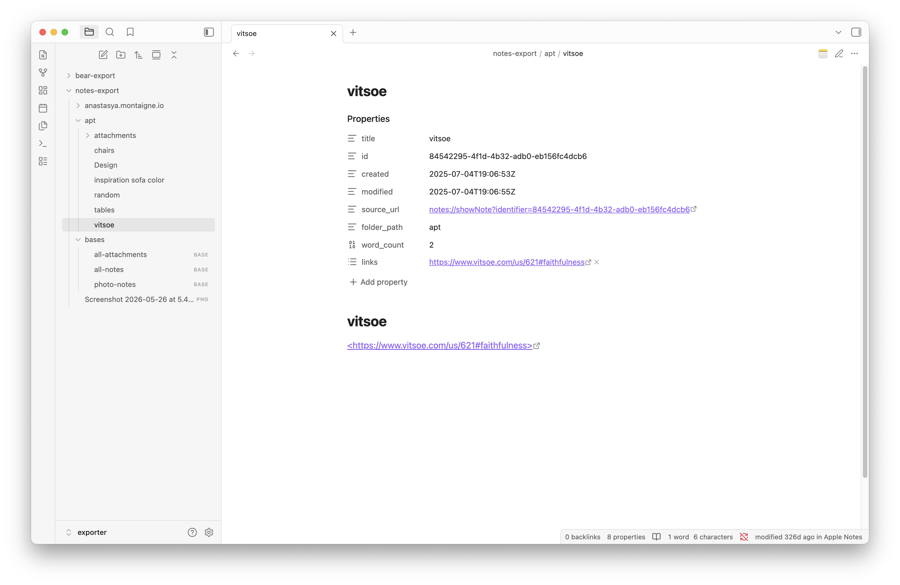

# Exporter

Capture in Apple Notes, think in Obsidian.

This plugin connects [Notes Exporter](https://apps.apple.com/us/app/notes-exporter/id6741618455?mt=12) with Obsidian. Export your Apple Notes and Bear Notes as markdown, open the folder as an Obsidian vault, and get native app integration right inside Obsidian.



## Why this exists

Apple Notes is great for quick capture -- Siri, share sheets, handwriting, instant sync. But it's a closed system. You can't query your notes, link them, or build on top of them.

Obsidian is great for thinking -- backlinks, Dataview, templates, plugins. But it can't read Apple Notes.

This plugin bridges them. Export your notes once or on a schedule, and Obsidian treats them as first-class citizens with deep links back to the source app.

## How it works

1. Export notes with [Notes Exporter](https://apps.apple.com/us/app/notes-exporter/id6741618455?mt=12) (select folders or tags, pick a destination folder)
2. Open that folder as an Obsidian vault
3. Install this plugin -- it reads `source_url` from frontmatter and adds native app integration

  

## Features

- native Apple Notes and Bear icons on `notes://` and `bear://` links in reading view, live preview, and properties panel
- "Open in Apple Notes" / "Open in Bear" in file and editor context menus
- native app icon button in the tab header bar
- status bar showing source app and last modified time
- command palette: "Open in native app"

## Frontmatter fields

Notes Exporter produces rich YAML frontmatter that works with Obsidian core features and Dataview:

| field | example | notes |
|---|---|---|
| `title` | `"Meeting notes"` | note title |
| `id` | `"A1B2C3..."` | Apple Notes identifier |
| `aliases` | `["Meeting notes"]` | searchable via Obsidian alias |
| `created` | `2025-01-15T10:30:00Z` | ISO 8601 |
| `modified` | `2025-01-15T14:22:00Z` | ISO 8601 |
| `source_url` | `"notes://showNote?identifier=..."` | deep link to source app |
| `tags` | `["work", "meetings"]` | Obsidian-compatible tags |
| `reading_time` | `3` | estimated minutes (200 wpm) |
| `pinned` | `true` | only if pinned |
| `shared` | `true` | only if shared |
| `collaborators` | `["email@example.com"]` | shared note participants |
| `folder_path` | `"Work/Projects"` | original folder hierarchy |
| `cover` | `"[[path/to/image.jpg]]"` | cover image wikilink |
| `word_count` | `642` | body text word count |
| `attachment_count` | `3` | images, PDFs, etc |
| `attachment_types` | `["image", "pdf"]` | types present |
| `has_checklist` | `true` | contains checklist items |
| `checklist_done` | `4` | completed items |
| `checklist_total` | `7` | total items |
| `links` | `["https://example.com"]` | URLs found in note |

Example Dataview queries:

```dataview
TABLE reading_time, word_count, modified
FROM ""
WHERE source_url
SORT modified DESC
```

```dataview
LIST
FROM #work
WHERE has_checklist AND checklist_done < checklist_total
```

## Compared to Obsidian Importer

Obsidian Importer is a one-time migration tool. This plugin + Notes Exporter is for ongoing use:

- re-export anytime to pick up changes (Importer is one-shot)
- proper tag extraction from Apple Notes folders and hashtags (Importer often loses tags)
- `source_url` deep links back to the original note (Importer has no source tracking)
- attachments copied alongside notes with correct references (Importer can break attachment links)
- rich frontmatter with word count, reading time, checklist stats, collaborators (Importer produces minimal metadata)
- works with both Apple Notes and Bear (Importer only handles Apple Notes)

If you've already left Apple Notes and just need a one-time import, Obsidian Importer works fine. If you still capture in Apple Notes and want your notes available in Obsidian, use this.

## Install

### From Obsidian community plugins

Search for "Exporter" in Settings > Community plugins > Browse.

### Manual

Copy `main.js`, `manifest.json`, and `styles.css` to your vault at `.obsidian/plugins/exporter/`.

## Development

```
npm install
npm run build       # build main.js
npm run dev         # watch mode
npm run typecheck   # type check
```

## License

MIT
